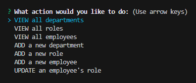

# MVR12bc-Employee-Inquisition
SQL Challenge: Employee Tracker

## Usage
This repo creates an employee management system to track Departments, Roles, and Employees. 
You can select form the menu to view Departments, Roles, or Employees as well as add to each and update employees roles. 
 

watch the video below to see how the employee tracker working

[Demo Video](https://drive.google.com/file/d/1b8pRKWoqYTsRsrLf3EWOXPp-qfFuPVaw/view)

## Contributors
Consulting and guidance used in creation of this repository include peers and resources (in no order) as follows:
- Daniel Cohen
- Matt Montiel
- Cameron Oberlies
- Lindsey Isaac

## License
[MIT License](./LICENSE)